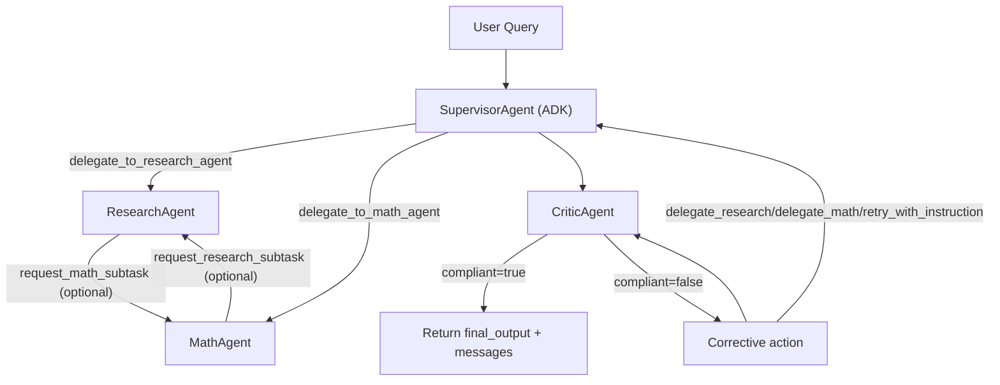

# Google ADK Supervisor

A multi-agent supervisor system built with Google ADK that routes user tasks between:

- `ResearchAgent` (Exa-first web search with Tavily/You.com fallbacks)
- `MathAgent` (arithmetic tools)
- `Supervisor Agent` (routing + synthesis)
- `CriticAgent` (post-response delegation/tool-use validator)

This repository includes:

- local interactive runner for the multi-agent supervisor workflow
- Braintrust eval suites and reusable scorers
- Modal remote eval server integration
- configurable prompts/models through Braintrust eval parameters

## Quick Start

1. Install dependencies:

```bash
pip install -r requirements.txt
```

2. Configure environment:

```bash
cp .env.example .env
```

Required keys:

- `GOOGLE_API_KEY` for direct Gemini calls, or `BRAINTRUST_USE_GATEWAY=true`
  with a Braintrust key that can use the configured Gemini provider
- `EXA_API_KEY` for primary web search
- Optional: `TAVILY_API_KEY` or `YDC_API_KEY` for fallback web search
- `BRAINTRUST_API_KEY` (if tracing/evals)
- `OPENAI_API_KEY` (used by judge scorers)
- Optional: `TRACE_PROFILE=full|lean` (default `full`)
  - `full`: existing `braintrust_adk` auto-instrumentation (verbose)
  - `lean`: explicit app spans only (invocation, handoff, llm_response_generation, tool_routing_decision)
- Optional: Braintrust AI Gateway
  - `BRAINTRUST_USE_GATEWAY=true`
  - `BRAINTRUST_GATEWAY_URL=https://gateway.braintrust.dev/v1`
  - `BRAINTRUST_GATEWAY_API_KEY` (falls back to `BRAINTRUST_API_KEY`)

3. Run local chat:

```bash
python -m src.local_runner
```

## Architecture



Runtime notes:

- Handoff spans remain explicit and stable: `handoff [ResearchAgent]`, `handoff [MathAgent]`.
- Critic validation is in-loop before final return, with `critic [CriticAgent]` task spans.
- Returned payload contract includes `final_output` and `messages`.

## Braintrust AI Gateway

When `BRAINTRUST_USE_GATEWAY=true`, this demo routes ADK Gemini model calls
through Braintrust AI Gateway by constructing ADK `LiteLlm` model objects
against the Gateway's OpenAI-compatible endpoint. The same toggle also routes
the eval judge OpenAI client through the gateway endpoint.
When `BRAINTRUST_PROJECT_ID` or `BRAINTRUST_PROJECT` is set, gateway-mode
clients include explicit Braintrust attribution headers (for example,
`x-bt-parent`) so gateway logs are tied to the expected project.

Default behavior is unchanged (`BRAINTRUST_USE_GATEWAY=false`), which keeps
direct provider calls.

## Evals

Run full supervisor eval:

```bash
braintrust eval evals/eval_supervisor.py
```

Run focused eval suites:

```bash
braintrust eval evals/eval_math_agent.py
braintrust eval evals/eval_research_agent.py
```

### Eval Parameters

All eval suites expose a stable parameter contract in
[`evals/parameters.py`](evals/parameters.py):

- Supervisor eval: `system_prompt`, `prompt_modification`,
  `research_agent_prompt`, `math_agent_prompt`
- Research eval: `research_agent_prompt`
- Math eval: `math_agent_prompt`

The `system_prompt`, `research_agent_prompt`, and `math_agent_prompt`
parameters are native Braintrust prompt objects, so the Playground renders a
real prompt editor with the model embedded in `options.model` instead of
separate plain-text prompt/model fields.

The repo applies a compatibility shim for older Braintrust SDK versions that do
not natively render single-field parameter defaults/descriptions in the
Playground. When native support is detected, the shim is skipped.

## Remote Eval Server (Modal)

Deploy:

```bash
modal deploy src/eval_server.py
```

Local serve:

```bash
modal serve src/eval_server.py
```

Then connect the endpoint from Braintrust Playground remote eval UI.

## Interactive Queries On Modal

After deploying `src/eval_server.py`, you can query the live multi-agent app directly:

- Browser UI: `https://<your-modal-url>/interactive`
- JSON API: `POST https://<your-modal-url>/interactive/query`

Example:

```bash
curl -X POST "https://<your-modal-url>/interactive/query" \
  -H "content-type: application/json" \
  -d '{"query":"What is 12*9?","workflow_name":"google-adk-supervisor-interactive"}'
```

Response includes:

- `final_output` (assistant answer)
- `messages` (serialized user/assistant/tool events)
- trace logging to Braintrust via ADK instrumentation

## Project Layout

- `src/agents/` - supervisor + specialist agent construction
- `src/agents/critic_agent.py` - critic agent prompt + construction
- `src/helpers.py` - ADK run loop + event serialization into eval message schema
- `evals/` - Braintrust eval tasks and scorers
- `src/eval_server.py` - Modal ASGI remote eval server
- `scorers.py` - reusable published scorers

## Notes

- Output contract: `{"final_output": str, "messages": [...]}` for scorer compatibility and UI.
- Routing inference relies on span/tool-call names (`research`, `math`, `delegate_to_*`, `tavily_search`, arithmetic tool names).
